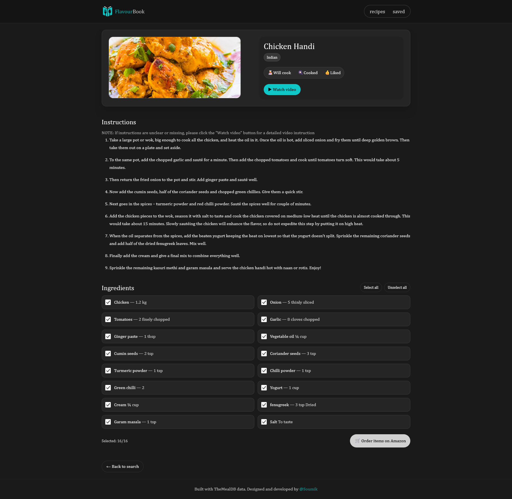

# Flavourbook — Find, cook, and save delicious recipes

Discover dishes from around the world, view clean step‑by‑step instructions, select ingredients to shop, watch related videos, and save what you’ll cook, cooked, or liked — all in a fast, modern React app.

- Live demo: https://flavourbook.smikx.dev

<p align="center">
  
  
</p>

## Highlights

- Global search with meaningful results and cuisine tags
- Polished detail page: hero image with fallback, cuisine chips, YouTube link
- Ingredient checklist with “Order selected on Amazon” flow
- Saved list with smooth filters: Will cook / Cooked / Liked
- Snappy UX: client‑side caching, optimistic UI, resilient fetches
- Modern stack: Vite + React 19 + TypeScript + Tailwind v4 + Framer Motion
- Thoughtful a11y and SEO defaults

## Why it stands out

- Product thinking: clear user journeys (discovery → details → action → save)
- Engineering care: cache with TTL + stale fallback, 8s abort, error‑safe parsing
- UX polish: animated highlights, image fallbacks, reduced motion support
- Maintainable structure: small, purposeful modules with shared types

## Quick start

- Node 18+ and npm required

```bash
npm install
npm run dev       # Vite dev server (default http://localhost:5173)
npm run build     # Type-check + production build
npm run preview   # Preview production build
```

## Project structure

```
src/
  App.tsx                # Routes (Home, RecipeDetail, Saved, 404)
  main.tsx               # App bootstrap
  index.css              # Global styles, font, design tokens (Tailwind v4)

  components/
    Layout.tsx           # Header/nav + animated tab highlight
    SearchBar.tsx        # Search input + submit
    RecipeCard.tsx       # Result card
    ImageWithFallback.tsx# Image loader with graceful fallback
    AnimatedFood.tsx     # Minimal SVG placeholder

  pages/
    Home.tsx             # Search + results grid
    RecipeDetail.tsx     # Details, ingredients, actions
    Saved.tsx            # Saved list with filters and statuses
    NotFound.tsx         # 404 with basic SEO controls

  services/
    api.ts               # TheMealDB wrappers (search, get by id, list by cuisine)
    cache.ts             # TTL cache with stale fallback + 8s timeout
    storage.ts           # Saved items in localStorage

  types.ts               # Shared types
```

- Routing: [`src/App.tsx`](src/App.tsx), layout: [`src/components/Layout.tsx`](src/components/Layout.tsx)
- Core services:
  - API: [`src/services/api.ts`](src/services/api.ts)
  - Cache: [`src/services/cache.ts`](src/services/cache.ts)
  - Storage: [`src/services/storage.ts`](src/services/storage.ts)
- Pages:
  - Home: [`src/pages/Home.tsx`](src/pages/Home.tsx)
  - Recipe details: [`src/pages/RecipeDetail.tsx`](src/pages/RecipeDetail.tsx)
  - Saved: [`src/pages/Saved.tsx`](src/pages/Saved.tsx)
  - 404: [`src/pages/NotFound.tsx`](src/pages/NotFound.tsx)

## Tech

- Vite 7 + React 19 + TypeScript
- React Router 6
- Tailwind CSS v4 (via `@tailwindcss/vite`)
- Framer Motion (micro‑interactions)

Key configs:
- Vite: [`vite.config.ts`](vite.config.ts)
- TS app: [`tsconfig.app.json`](tsconfig.app.json)

## Performance, reliability, and UX

- Cached fetch with TTL and stale fallback: [`services/cache.ts`](src/services/cache.ts)
  - 8s request timeout with AbortController
  - Graceful localStorage quota handling
- Image fallback for broken/missing URLs: [`components/ImageWithFallback.tsx`](src/components/ImageWithFallback.tsx)
- Preconnect and font preload in HTML: [`index.html`](index.html)
- Reduced motion support and accessible focus rings: [`src/index.css`](src/index.css)
- SEO basics + 404 noindex: [`pages/NotFound.tsx`](src/pages/NotFound.tsx)

## Deployment

- SPA routing ready for static hosts (Netlify): [`public/_redirects`](public/_redirects)
- Production build: `npm run build` → `dist/`, then serve statically

## Roadmap

- Advanced search (filters: area, category, ingredients)
- Pagination and infinite scroll
- Service Worker for offline caching of last searches
- Shareable saved lists
- Unit tests for services and hooks

## Screenshots

<p align="center">
  
  
</p>
<p align="center">
  
  
</p>
<p align="center">
  
  
</p>

## Attribution

This project uses the free TheMealDB API for recipe data and
